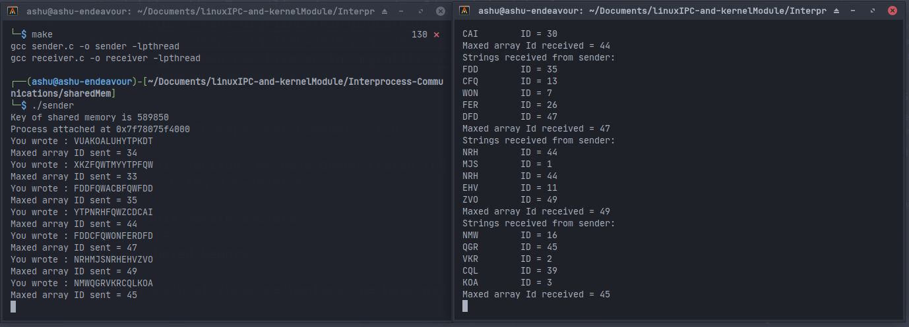
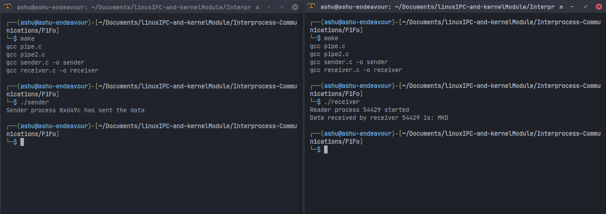
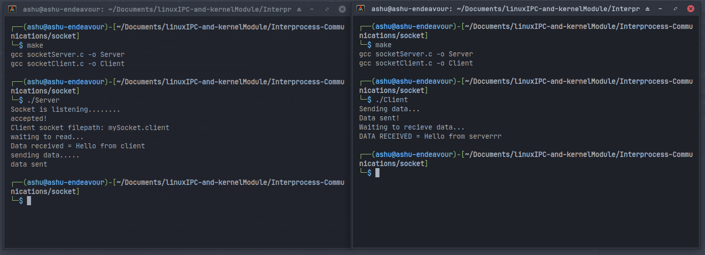

# Linux process syncronization, Inter-process communication and Custom Kernel Module

This repository has three parts:

* Slightly modifying and solving the famous **Dining philosophers** problem using mutex locks and semaphores.
* Demonstrating Interprocess communication between 2 processes using 3 mechanisms:
  
  * FIFOs
  * Shared Memory
  * UNIX domain sockets
  
* Writing own small linux kernel module using C language.

> Detailed explaination of all the parts:
  
## Modified Dining Philosophers Problem

The dining philosophers problem contains five philosophers sitting on a round
table can perform only one among two actions – eat and think. For eating, each
of them requires two forks, one kept beside each person. Typically, allowing
unrestricted access to the forks may result in a **deadlock**.
Inside the folder `modifiedDiningPhilosophers`, there are 4 programs to simulate the philosophers using threads, and the forks using global variables. The deadlock has been resolved using the following techniques: \

1. Strict ordering of resource requests (Using thread locks)
2. Utilization of semaphores to access the resources.

* `singleBowl-Mutex.c` resolves the problem of 1 saucebowl with 5 philosophers using mutex locks.
* `singleBowl-Semaphores.c` resolves the problem of 1 saucebowl with 5 philosophers using OS semaphores.
* `twoBowls-Mutex.c` resolves the problem of 2 saucebowl with 5 philosophers using mutex locks.
* `twoBowls-Semaphores.c` resolves the problem of 2 saucebowl with 5 philosophers using semaphores.

To run the programs, run the following commands:

``` bash
    git clone https://github.com/Ashutosh-Gera/LinuxIPC-KernelModule
    cd modifiedDiningPhilosophers
    sudo make
    sudo ./singleBowl-Mutex
    sudo ./singleBowl-Semaphores
    sudo ./twoBowls-Mutex
    sudo ./twoBowls-Semaphores
```

Resources used:

* [Prof. Arani Bhattacharya (IIIT Delhi) 's lecture notes](https://faculty.iiitd.ac.in/~arani/teaching/teaching_cse231/)
* [Prof. Mythili Vykuru (IIT Bombay)'s notes](https://www.cse.iitb.ac.in/~mythili/os/)
* [Wikipedia](https://en.wikipedia.org/wiki/Dining_philosophers_problem)
* [Manpage - mutex lock](https://man7.org/linux/man-pages/man3/pthread_mutex_lock.3p.html)
* [Manpage - mutex destroy](https://man7.org/linux/man-pages/man3/pthread_mutex_destroy.3p.html)
* [Scalar article](https://www.scaler.com/topics/operating-system/dining-philosophers-problem-in-os/)
* [Semaphore init - Manpage](https://man7.org/linux/man-pages/man3/sem_init.3.html)
* [Semaphore wait - Manpage](https://man7.org/linux/man-pages/man3/sem_wait.3.html)
* [Mutex lock - Manpage](https://man7.org/linux/man-pages/man3/pthread_mutex_lock.3p.html)
* [Little Book of semaphores](https://www.cse.iitb.ac.in/~mythili/os/references/LittleBookOfSemaphores.pdf)


## Linux Interprocess Communication

In this section, we have demonstrated interprocess communication in Linux using 3 mechanisms:

1. Unix domain sockets
2. FiFo
3. Shared Memory

For each of these mechanisms, I have written 2 programs i.e 

1. `sender`
2. `receiver`

> NOTE: You can modify the data that needs to be sent/read however you need, I have just sent some test data.

To run the programs, run the below commands [I have shown for shared memory, you can do for FiFo and/or socket similarily]:

``` bash
# If you haven't cloned this repository yet
git clone https://github.com/Ashutosh-Gera/LinuxIPC-KernelModule /
# common steps
cd <your-path>/Interprocess-Communications
cd sharedMem/
make
```

 > Open 2 terminals side by side (or use [tmux](https://github.com/tmux/tmux/wiki))

``` bash
#On first terminal
./Server
#On second terminal
./Client
```

> NOTE: Run these programs simultaneously together.

Below are the images for these processes working for reference:

* Shared Memory IPC 
* FiFo IPC 
* UNIX domain Sockets IPC 

Resources used:

* Beej's guide to UNIX IPC [book]
* [IBM documentation for sockets](https://www.ibm.com/docs/en/ztpf/1.1.0.15?topic=considerations-unix-domain-sockets)
* Linux Manpages

## Custom Kernel Module

In this part, I have written my own small kernel module. I have implemented a kernel system call as a module. The task of the system call
is to read the entries of the process `task_struct` corresponding to any
given process (supplied as input via command line argument) and prints the values of the following field:

1. pid (process id)
2. user_id
3. process group id (pgid)
4. command path

The system call is implemented **in the kernel** and is functional **only when the module is loaded**.

To run this module, you should run the following commands:

> NOTE: This module is written for [Artix Runit Kernel](https://artixlinux.org/download.php#:~:text=15%3A20%3A10-,artix%2Dbase%2Drunit%2D20230605%2Dx86_64.iso,-792%20MB) which is a very raw arch linux kernel. It may not work for other operating systems, thus, to test it, first you'd need to install and compile this kernel (preferably on a Virtual machine) and then proceed with the commands.

``` bash
# If you have not cloned this repo yet
git clone https://github.com/Ashutosh-Gera/LinuxIPC-KernelModule
cd <your-path>/CustomKernelModule
sudo make
```

> This compiles this module and generates a .ko (loadable kernel file), among others.

``` bash
# Now to load our kernel module and use it
insmod myModule.ko arg=10 #inserts (loads) the module
dmesg # to check the output for the given argument (10 in this case)
rmmod myModule # to unload our module
```

Resources used:

* [The Linux Kernel Module Programming Guide](https://sysprog21.github.io/lkmpg/#system-calls)
* [Linux syscall tracer](https://strace.io/)
* [Blog - Linux world](https://tuxthink.blogspot.com/2012/07/module-to-find-task-from-its-pid.html)
* [Stack Overflow :wink:](https://stackoverflow.com/questions/8547332/efficient-way-to-find-task-struct-by-pid)

That's it for today! Thank you for coming here. Hope you learnt something today (Do star the repo if you did :wink:)

# Made with :blue_heart: by Ashutosh Gera